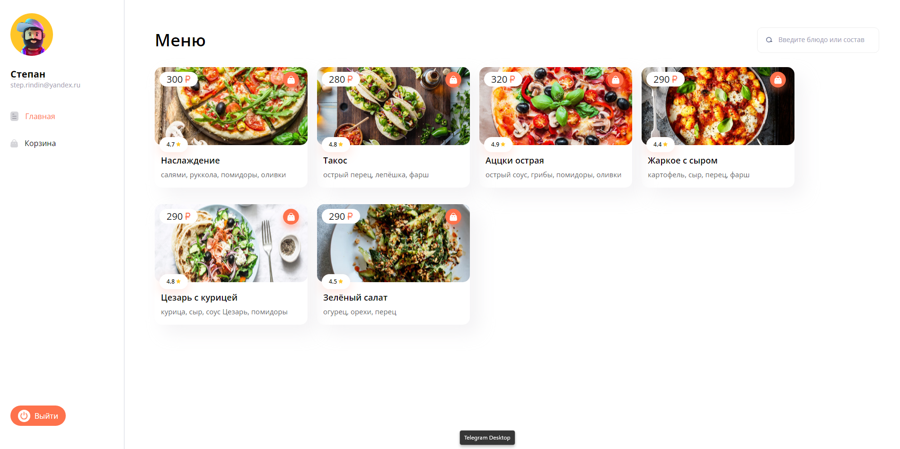
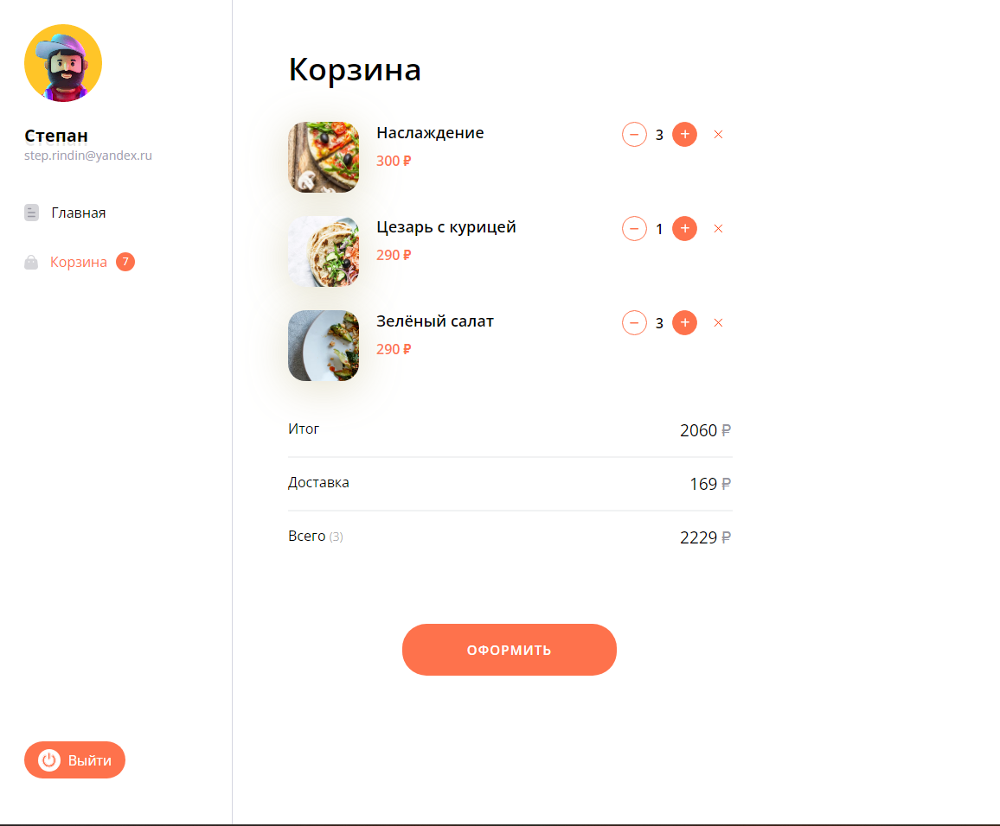
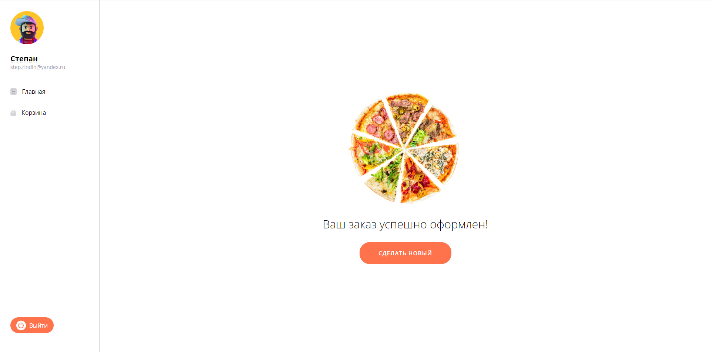

# Pizza Store


Учебный проект магазина пиццы, созданный для изучения работы с Redux Toolkit (RTK) и Axios. В проекте реализованы основные функции интернет-магазина, включая возможность оформления заказа, авторизацию пользователей и корзину для покупок.

## Функциональность

- **Главная страница**: Отображение доступных пицц с поиском.
- **Корзина**: Добавление/удаление товаров, редактирование количества.
- **Авторизация**: Вход и регистрация пользователей.
- **Оформление заказа**: Оформление и подтверждение заказа с использованием данных корзины.
- **Загрузка данных**: Использование Axios для взаимодействия с API.
- **Состояние приложения**: Управление состоянием с помощью Redux Toolkit (RTK).

## Использованные технологии

- **React**: Для создания пользовательского интерфейса.
- **Redux Toolkit (RTK)**: Для управления состоянием приложения.
- **Axios**: Для работы с запросами к API.
- **React Router**: Для управления маршрутами.
- **TypeScript**: Для типизации проекта.
- **HTML/CSS**: Для стилизации страниц.

## Установка и запуск

1. Склонируйте репозиторий:

   ```bash
   git clone https://github.com/opigon1/pizza-app.git
   ```

2. Перейдите в папку с проектом:

   ```bash
   cd pizza-app
   ```

3. Установите зависимости:

   ```bash
   npm install
   ```

4. Запустите проект:

   ```bash
   npm run dev
   ```

Проект будет доступен по адресу: `http://localhost:5173/`.

## Скриншоты

### Страница корзины



### Страница корзины



## API


## Планы на будущее

- Оформление страницы с карточкой продукта.
